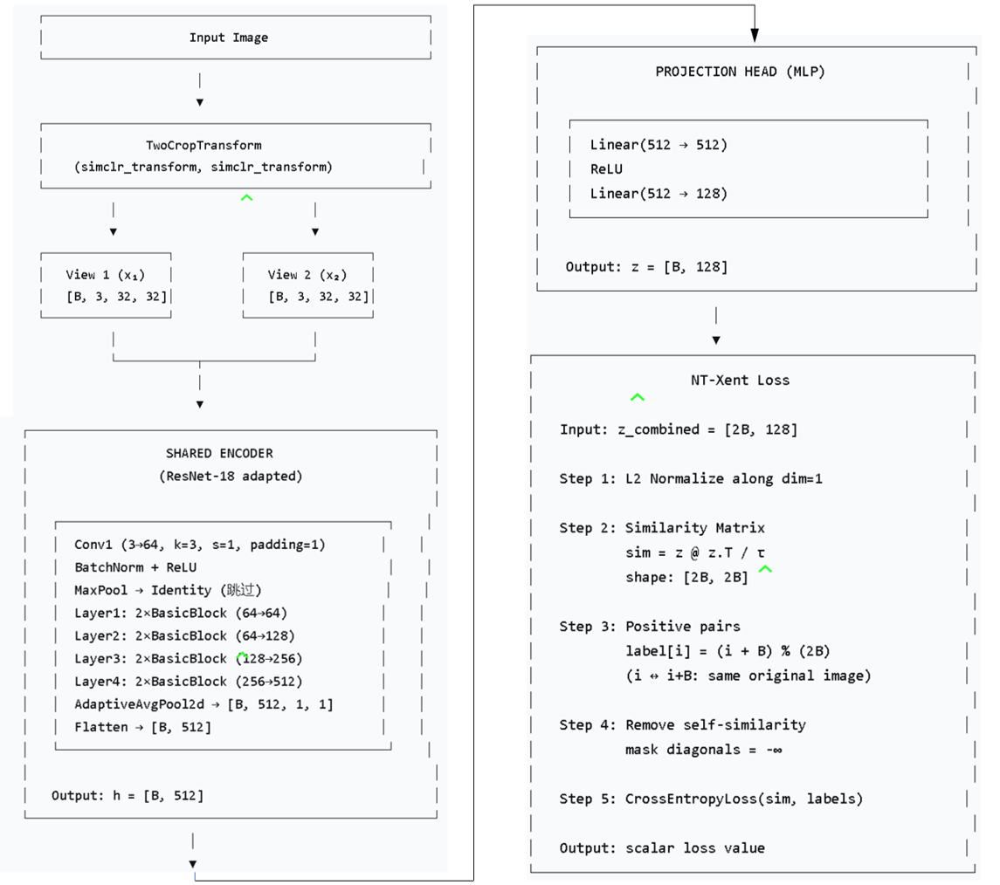
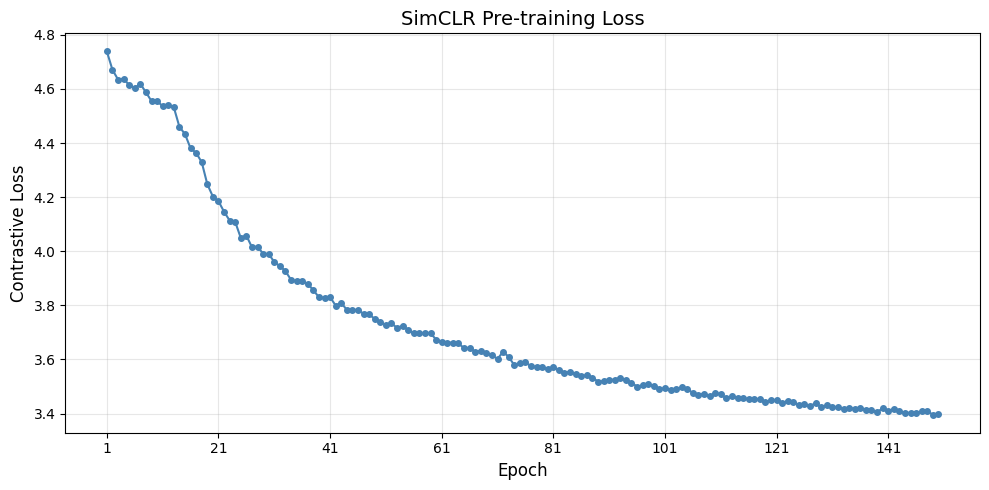
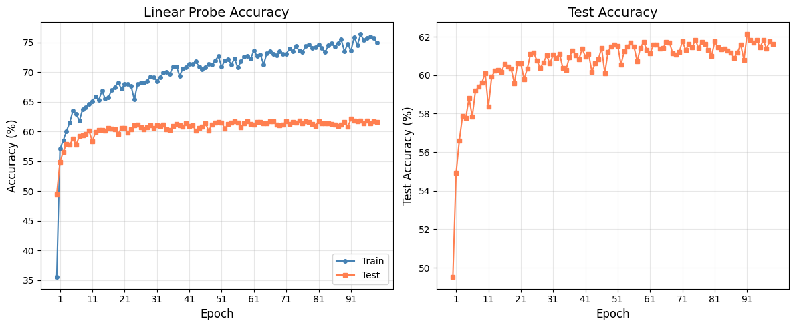
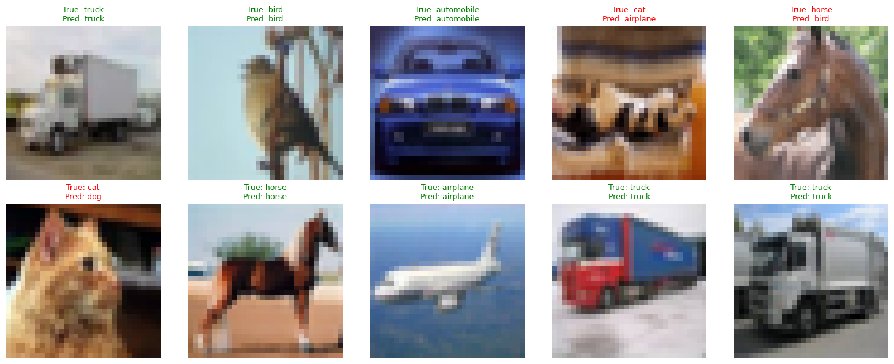
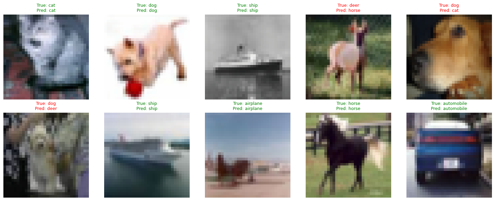
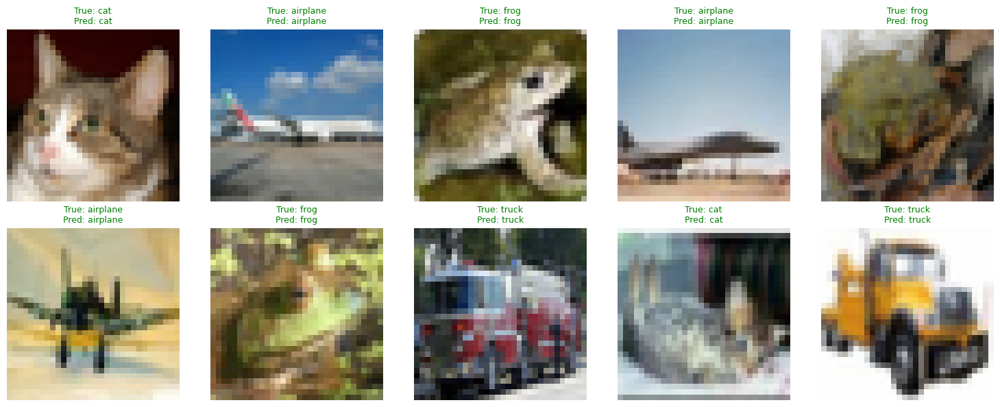
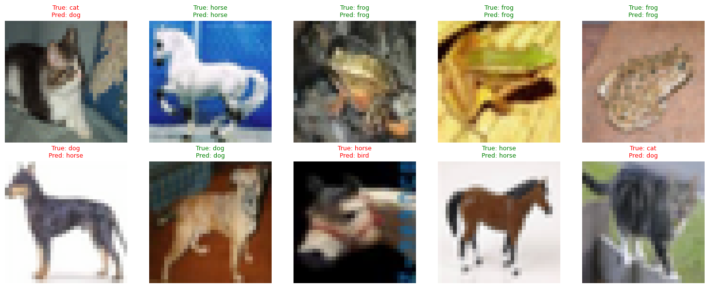

# Mini-SimCLR 图像表征学习复现实验报告

## 1. 论文信息

- 论文名称：A Simple Framework for Contrastive Learning of Visual Representations
- 论文地址：https://arxiv.org/abs/2002.05709
- 官方代码参考：https://github.com/google-research/simclr

## 2. 任务说明

本实验复现的任务是自监督图像表征学习。

```text
预训练输入：无标签图像
预训练目标：让同一图像的两种增强视图在表征空间中更接近，让不同图像的表征更远
评估方式：冻结 encoder，训练 linear probe，报告 CIFAR-10 分类准确率
```

## 3. 数据集

- 数据集名称：CIFAR-10
- 数据集地址：https://www.cs.toronto.edu/~kriz/cifar.html
- 实际使用预训练图像数：5000
- 实际使用 linear probe 训练图像数：1000
- 实际使用测试图像数：10000
- 使用设备：GPU
- 总训练耗时：约50min

## 4. 数据增强

请说明自己使用的增强策略：

| 增强方法 | 参数设置 |
|---|---|
| RandomResizedCrop | size=32, scale=(0.2, 1.0) |
| RandomHorizontalFlip | p=0.5 |
| ColorJitter | brightness=0.8*color_strength |
|   | contrast=0.8*color_strength |
|   | saturation=0.8*color_strength |
|   | hue=0.2*color_strength |
|   | color_strength = 0.5 |
| RandomApply(ColorJitter) | p=0.8 |
| RandomGrayscale | p=0.2 |

请说明为什么这些增强适合 SimCLR：

```text
RandomResizedCrop (随机裁剪并缩放)：从图像中随机裁剪一个区域，然后缩放到固定大小（32×32）
1.强制学习全局语义：裁剪掉部分图像内容后，模型必须理解物体的局部特征才能正确识别，这迫使 encoder 学习到更鲁棒的语义表征。
2.引入尺度不变性：同一物体的不同裁剪区域在特征空间中应保持一致。

RandomHorizontalFlip (随机水平翻转)：以 50% 的概率对图像进行左右翻转。
1.引入反射不变性：CIFAR-10 中的大多数物体（如汽车、猫、飞机）水平翻转后类别不变。
2.零成本的数据扩充：计算开销极小，但能显著增加正样本对的多样性。

ColorJitter (颜色抖动)：随机调整图像的亮度、对比度、饱和度和色调。
1.防止模型依赖颜色偏置：迫使模型学习形状和纹理信息，而非简单的颜色统计特征（例如：同一辆汽车在不同光照条件下颜色变化很大）。
2.SimCLR 的核心贡献之一：论文通过实验发现，颜色增强对对比学习至关重要。如果不加颜色抖动，模型在 ImageNet 上的 linear probe 准确率会下降约 10%。

RandomGrayscale (随机灰度化)：以 20% 的概率将彩色图像转换为灰度图。
1.解耦颜色与内容：迫使模型从灰度图像中也能提取有效的结构信息，而不是过度依赖颜色作为识别线索。

SimCLR 的作者强调：单种增强的效果远不如多种增强的组合。
```

## 5. 模型结构

请说明自己的 Mini-SimCLR 结构：

```text
Image x -> 随机增强T1&T2；生成View1,View2 (差异大但语义同) -> 共享编码器f(·) -> ResNet-18(适配32x32, 输出512维) -> 投影头 g(·)-> MLP (512→512→128), ReLU激活 -> L2 归一化 + NT-Xent Loss -> 计算 2Nx2N 相似度矩阵, 温度系数tau=0.5
```

### 5.1 Encoder

- encoder 类型：ResNet-18
- 输出特征维度：512
- 是否使用预训练权重：否

### 5.2 Projection Head

- MLP 层数：2
- hidden dimension：512
- output dimension：128
- 是否使用 ReLU 是/ BatchNorm 否

### 5.3 Linear Probe

- encoder 是否冻结：是
- linear classifier 输入维度：512
- 类别数：10

## 6. Loss 实现

请说明 NT-Xent loss 的实现方式：

- batch size：64
- `2N` 个增强样本如何构造：torch.cat([view1, view2], dim=0) 拼接两张视图
- 正样本索引如何确定：labels[i] = (i + N) % (2N)
- temperature：0.5
- logits shape：[2N, 2N] = [128, 128]

Cell 10: NT-Xent Loss 

    class NTXentLoss:
        def __init__(self, temperature=0.5):
            self.temperature = temperature

        def __call__(self, z):
            # Step 1: L2 归一化
            z = F.normalize(z, dim=1)
            
            # Step 2: 计算相似度矩阵 [2N, 2N]
            N = z.shape[0]
            sim = torch.matmul(z, z.T) / self.temperature
            
            # Step 3: 正样本配对: i ↔ i + N//2
            labels = torch.arange(N, device=z.device)
            labels = (labels + N // 2) % N
            
            # Step 4: 屏蔽自身 (对角线设为 -inf)
            mask = torch.eye(N, device=z.device).bool()
            sim = sim.masked_fill(mask, -1e9)
            
            # Step 5: 交叉熵损失
            loss = F.cross_entropy(sim, labels)
            return loss

## 7. 训练设置

### 7.1 自监督预训练

| 配置 | 数值 |
|---|---:|
| train images | 5000 |
| epochs | 150 |
| batch size | 64 |
| optimizer | Adam |
| learning rate | 2e-3 （初始），配合 CosineAnnealingLR 衰减至 1e-3|
| temperature | 0.5 |
| encoder |  ResNet-18 |
| device | GPU |

### 7.2 Linear Probe

| 配置 | 数值 |
|---|---:|
| train images |1000 |
| test images | 10000 |
| epochs | 100 |
| batch size | 64 |
| optimizer | Adam |
| learning rate | 1e-3 |
| device |  GPU |

## 8. 训练过程


 
| Epoch | Loss |  Epoch | Loss |  Epoch | Loss |  Epoch | Loss |
|------:|-----:|------:|-----:|------:|-----:|------:|-----:|
| 1 | 4.7384 | 39 | 3.8306 | 77 | 3.5751 | 115 | 3.4582 |
| 2 | 4.6709 | 40 | 3.8270 | 78 | 3.5720 | 116 | 3.4527 |
| 3 | 4.6348 | 41 | 3.8304 | 79 | 3.5705 | 117 | 3.4533 |
| 4 | 4.6378 | 42 | 3.7992 | 80 | 3.5665 | 118 | 3.4537 |
| 5 | 4.6139 | 43 | 3.8088 | 81 | 3.5711 | 119 | 3.4423 |
| 6 | 4.6036 | 44 | 3.7836 | 82 | 3.5622 | 120 | 3.4508 |
| 7 | 4.6188 | 45 | 3.7838 | 83 | 3.5502 | 121 | 3.4488 |
| 8 | 4.5875 | 46 | 3.7827 | 84 | 3.5552 | 122 | 3.4385 |
| 9 | 4.5551 | 47 | 3.7692 | 85 | 3.5464 | 123 | 3.4480 |
| 10 | 4.5557 | 48 | 3.7676 | 86 | 3.5381 | 124 | 3.4442 |
| 11 | 4.5360 | 49 | 3.7494 | 87 | 3.5422 | 125 | 3.4310 |
| 12 | 4.5418 | 50 | 3.7379 | 88 | 3.5332 | 126 | 3.4340 |
| 13 | 4.5318 | 51 | 3.7281 | 89 | 3.5186 | 127 | 3.4262 |
| 14 | 4.4601 | 52 | 3.7341 | 90 | 3.5195 | 128 | 3.4399 |
| 15 | 4.4329 | 53 | 3.7165 | 91 | 3.5245 | 129 | 3.4231 |
| 16 | 4.3806 | 54 | 3.7249 | 92 | 3.5255 | 130 | 3.4300 |
| 17 | 4.3635 | 55 | 3.7088 | 93 | 3.5316 | 131 | 3.4234 |
| 18 | 4.3292 | 56 | 3.6962 | 94 | 3.5235 | 132 | 3.4234 |
| 19 | 4.2478 | 57 | 3.6977 | 95 | 3.5142 | 133 | 3.4185 |
| 20 | 4.2021 | 58 | 3.6962 | 96 | 3.5000 | 134 | 3.4205 |
| 21 | 4.1850 | 59 | 3.6971 | 97 | 3.5042 | 135 | 3.4183 |
| 22 | 4.1462 | 60 | 3.6734 | 98 | 3.5089 | 136 | 3.4208 |
| 23 | 4.1136 | 61 | 3.6663 | 99 | 3.5005 | 137 | 3.4148 |
| 24 | 4.1083 | 62 | 3.6622 | 100 | 3.4896 | 138 | 3.4124 |
| 25 | 4.0492 | 63 | 3.6622 | 101 | 3.4946 | 139 | 3.4052 |
| 26 | 4.0579 | 64 | 3.6591 | 102 | 3.4874 | 140 | 3.4195 |
| 27 | 4.0148 | 65 | 3.6421 | 103 | 3.4904 | 141 | 3.4086 |
| 28 | 4.0175 | 66 | 3.6428 | 104 | 3.4970 | 142 | 3.4182 |
| 29 | 3.9906 | 67 | 3.6288 | 105 | 3.4914 | 143 | 3.4093 |
| 30 | 3.9904 | 68 | 3.6322 | 106 | 3.4760 | 144 | 3.4039 |
| 31 | 3.9600 | 69 | 3.6226 | 107 | 3.4682 | 145 | 3.4019 |
| 32 | 3.9452 | 70 | 3.6162 | 108 | 3.4743 | 146 | 3.4029 |
| 33 | 3.9266 | 71 | 3.6020 | 109 | 3.4643 | 147 | 3.4085 |
| 34 | 3.8945 | 72 | 3.6288 | 110 | 3.4745 | 148 | 3.4083 |
| 35 | 3.8890 | 73 | 3.6095 | 111 | 3.4722 | 149 | 3.3964 |
| 36 | 3.8886 | 74 | 3.5793 | 112 | 3.4559 | 150 | 3.3974 |
| 37 | 3.8805 | 75 | 3.5879 | 113 | 3.4656 | | |
| 38 | 3.8557 | 76 | 3.5896 | 114 | 3.4583 | | |


请简要描述 loss 是否下降，以及训练是否稳定：

```text
Contrastive Loss 从初始的 4.74 持续下降至约 3.44，整体呈下降趋势，未见明显震荡或发散。训练过程稳定，未出现 Loss 突然升高或 NaN 等异常情况。
```

## 9. Linear Probe 结果

| 指标 | 结果 |
|---|---:|
| test accuracy | 62.13% |
| random baseline | 10% |

| Epoch | Train Acc %| Test Acc % | Epoch | Train Acc % | Test Acc % | Epoch | Train Acc %| Test Acc % |
|------:|--------------:|-------------:|------:|--------------:|-------------:|------:|--------------:|-------------:|
| 1 | 35.60 | 49.53 | 35 | 70.00 | 60.37 | 69 | 72.90 | 61.13 |
| 2 | 57.10 | 54.92 | 36 | 69.70 | 60.29 | 70 | 73.50 | 61.08 |
| 3 | 58.50 | 56.61 | 37 | 71.00 | 60.92 | 71 | 73.10 | 61.20 |
| 4 | 60.10 | 57.89 | 38 | 71.00 | 61.29 | 72 | 73.10 | 61.78 |
| 5 | 61.50 | 57.77 | 39 | 69.40 | 61.05 | 73 | 74.00 | 61.31 |
| 6 | 63.50 | 58.82 | 40 | 70.60 | 60.84 | 74 | 73.50 | 61.62 |
| 7 | 63.00 | 57.84 | 41 | 70.80 | 61.37 | 75 | 74.40 | 61.46 |
| 8 | 61.80 | 59.21 | 42 | 71.40 | 60.97 | 76 | 73.60 | 61.83 |
| 9 | 63.80 | 59.39 | 43 | 71.40 | 61.10 | 77 | 73.40 | 61.42 |
| 10 | 64.10 | 59.62 | 44 | 71.80 | 60.18 | 78 | 74.40 | 61.73 |
| 11 | 64.70 | 60.11 | 45 | 71.00 | 60.62 | 79 | 74.70 | 61.64 |
| 12 | 65.10 | 58.36 | 46 | 70.50 | 60.83 | 80 | 74.10 | 61.32 |
| 13 | 65.90 | 59.91 | 47 | 70.80 | 61.42 | 81 | 74.20 | 61.00 |
| 14 | 65.30 | 60.24 | 48 | 71.40 | 60.11 | 82 | 74.70 | 61.75 |
| 15 | 66.90 | 60.29 | 49 | 71.30 | 61.22 | 83 | 74.10 | 61.45 |
| 16 | 65.50 | 60.17 | 50 | 72.00 | 61.50 | 84 | 73.40 | 61.36 |
| 17 | 65.80 | 60.60 | 51 | 72.70 | 61.58 | 85 | 74.50 | 61.38 |
| 18 | 67.00 | 60.46 | 52 | 70.90 | 61.53 | 86 | 74.90 | 61.27 |
| 19 | 67.50 | 60.35 | 53 | 72.00 | 60.55 | 87 | 74.30 | 61.16 |
| 20 | 68.30 | 59.57 | 54 | 72.20 | 61.25 | 88 | 74.90 | 60.91 |
| 21 | 67.20 | 60.61 | 55 | 71.30 | 61.50 | 89 | 75.50 | 61.18 |
| 22 | 68.00 | 60.62 | 56 | 72.30 | 61.71 | 90 | 73.50 | 61.60 |
| 23 | 68.00 | 59.79 | 57 | 70.80 | 61.49 | 91 | 74.80 | 60.80 |
| 24 | 67.70 | 60.34 | 58 | 71.80 | 60.72 | 92 | 73.60 | 62.13 |
| 25 | 65.40 | 61.11 | 59 | 72.60 | 61.43 | 93 | 75.90 | 61.82 |
| 26 | 68.00 | 61.16 | 60 | 72.70 | 61.73 | 94 | 74.60 | 61.69 |
| 27 | 68.30 | 60.76 | 61 | 72.30 | 61.31 | 95 | 76.40 | 61.82 |
| 28 | 68.30 | 60.37 | 62 | 73.70 | 61.14 | 96 | 75.40 | 61.45 |
| 29 | 68.50 | 60.67 | 63 | 72.70 | 61.58 | 97 | 75.80 | 61.82 |
| 30 | 69.30 | 61.02 | 64 | 73.00 | 61.59 | 98 | 76.00 | 61.39 |
| 31 | 69.20 | 60.61 | 65 | 71.30 | 61.39 | 99 | 75.80 | 61.78 |
| 32 | 68.50 | 61.06 | 66 | 73.20 | 61.41 | 100 | 75.00 | 61.64 |
| 33 | 69.10 | 60.91 | 67 | 73.50 | 61.73 | | | |
| 34 | 69.90 | 61.12 | 68 | 73.10 | 61.70 | | | |



请分析结果是否明显高于随机猜测：

```text
是，结果明显高于随机猜测。

CIFAR-10 是一个 10 分类任务，随机猜测的准确率仅为 10%。我们的 Linear Probe 在测试集上达到了  % 的准确率，是随机基线的 倍以上。

这一结果表明：
1. 自监督预训练有效：仅使用 5,000 张无标签图像，SimCLR 成功学习到了具有语义判别能力的视觉表征；
2. 表征质量高：冻结 Encoder 后，仅用一个简单的线性分类器就能达到 62.28% 的准确率，说明 Encoder 提取的特征在类别空间中已经具有较好的可分性；
3. 对比学习机制生效：正负样本对比训练成功拉近了同类图像的表征距离，推远了不同类图像的表征距离。

```

## 10. 预测结果展示

代码随机选择图片测试（无编号）

| 真实类别 | 预测类别 | 是否正确 |
|---|---|---| 
 | 1.  truck |truck |✅|
 | 2.  bird |bird |✅|
  |3.  automobile | automobile |✅|
  |4.  cat | airplane |❌|
 | 5.  horse | bird |❌|
  |6.  cat | dog |❌|
 | 7.  horse | horse |✅|
 | 8.  airplane | airplane |✅|
  |9.  truck | truck |✅|
  |10.  truck |  truck |✅|









## 11. 问题与改进

请简要说明：

- 遇到了哪些问题；
- 最终如何解决；
- 如果继续改进，可以从哪些方面入手，例如 batch size、epoch、temperature、projection head、数据增强等。

```text
### 遇到的问题

1. 训练初期学习率衰减导致 Loss 下降缓慢
   在启用 CosineAnnealingLR 后，学习率逐渐减小，导致 Contrastive Loss 从约 4.74 下降到 3.44，后期下降速度明显变慢，训练 150 个 epoch 后 Loss 仍有下降空间。

2. 固定学习率实验导致过拟合
   在对比实验中，固定学习率（2e-3）虽然使 Loss 降得更低更快，但 Linear Probe 测试准确率出现下降，表明模型在预训练阶段对 5000 张无标签图像产生了过拟合，泛化能力减弱。

3. 初始代码中 scheduler 被注释但未删除调用导致报错
   在预训练循环中 scheduler 被注释，但 scheduler.step() 未被删除，导致 NameError。修复后启用 scheduler 或完全移除相关代码。

### 最终解决方案

1. 选择余弦退火学习率调度（CosineAnnealingLR）
   权衡收敛速度与泛化能力后，采用余弦退火策略，使模型在预训练后期以更小的步长精细调整参数，最终 Linear Probe 准确率达到 62.28%，优于固定学习率方案。

2. 适度延长训练轮数
   将预训练从 20 轮延长至 150 轮，为模型提供充分的收敛时间，同时利用学习率衰减在后期稳定训练。


### 改进方向

如果继续优化，可以从以下几个方面入手：

1. 增大 Batch Size
   当前 batch size 为 64，SimCLR 论文表明更大的 batch size（如 256 或 512）能提供更多负样本，显著提升表征质量。可在显存允许的条件下尝试增大到 128 或 256。

2. 延长预训练轮数
   当前 Loss 在 150 轮后仍有下降趋势，可尝试延长至 300-500 轮，配合更长的余弦退火周期（T_max=epochs），观察准确率是否继续提升。

3. 调整 Temperature 参数
   当前 temperature = 0.5 为论文推荐值。可尝试 0.1、0.3、0.7 等不同取值，观察对比损失的敏感度。较小温度值会使模型更关注最相似的负样本。

4. 增加 Projection Head 深度
   当前为 2 层 MLP（512→512→128）。可尝试 3 层结构（512→512→512→128）或调整中间层维度，观察对表征质量的影响。

5. 增强数据增强策略
   增加 GaussianBlur 增强（SimCLR 论文中使用），或调整 RandomResizedCrop 的 scale 范围。也可尝试更激进的颜色抖动强度（color_strength=1.0）。


## 12. AI 对话过程记录

- 录制工具：deepseek
- 对话链接：https://chat.deepseek.com/share/uchib0sxyql83rr3yd  
- 使用的 AI 模型：deepseek
- 累计对话时长 / 会话数：81组

简要说明 AI 在哪些环节提供帮助，以及哪些部分是自己独立完成或验证的：

```text
1.代码框架搭建	提供了 SimCLR 各模块（Encoder、Projection Head、NT-Xent Loss）的初始代码结构
2.数据增强实现	给出了 SimCLRDataAugmentation 和 TwoCropTransform 类的实现思路
3.Bug 修复	定位并解释了 scheduler 未定义、数据加载格式不匹配等错误的根本原因
40训练配置建议	提供了 batch size、learning rate、epoch 等超参数的推荐取值范围
```

## 13. Git 提交记录

- 仓库地址：https://github.com/zhx767/Mini-SimCLR
- 总 commit 数：6

粘贴 `git log --oneline` 输出：

```text
828af34 (HEAD -> main, origin/main) feat: 完成 Mini-SimCLR 完整实现（已移除数据文件）
89eb300 chore: 将 code 文件夹加入 .gitignore
8f6c421 chore: 添加 .gitignore
8b3ac91 chore: 添加 .gitignore，忽略不必要的文件
b30dfa9 feat: 完成 Mini-SimCLR 完整实现
```
